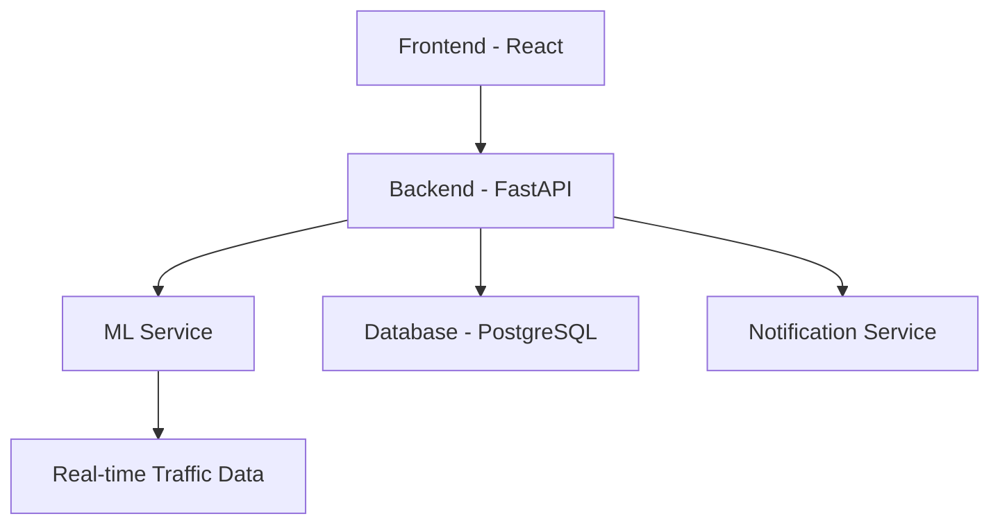

# 🚦 Traffic Anomaly Detection System

[](https://opensource.org/licenses/MIT)
[](https://www.python.org/)
[](https://reactjs.org/)
[](https://fastapi.tiangolo.com/)
[](https://www.docker.com/)

> 🔍 A cutting-edge real-time traffic monitoring system powered by AI/ML for detecting and reporting traffic anomalies.

## 🌟 Key Features

- 🤖 **Real-time Anomaly Detection**
  - Advanced ML algorithms (Isolation Forest & AutoEncoders)
  - Continuous traffic pattern monitoring
  - Instant anomaly alerts and notifications

- 📊 **Interactive Dashboard**
  - Real-time traffic visualization
  - Anomaly tracking and reporting
  - Historical data analysis
  - Customizable alerts and thresholds

- 🧠 **AI-Powered Analysis**
  - Automated anomaly classification
  - Detailed incident reports generation
  - Pattern recognition and trend analysis

- 🔐 **Security & Access Control**
  - JWT authentication
  - Role-based access management
  - Secure API endpoints

## 🏗️ System Architecture



### 🔧 Technology Stack

- **Frontend**: React.js with Material-UI
- **Backend**: FastAPI (Python)
- **Database**: PostgreSQL
- **ML Service**: Python (scikit-learn, TensorFlow)
- **AI Integration**: Ollama, GPT-4
- **Notifications**: SendGrid (Email), OneSignal (Push)
- **Deployment**: Docker & Docker Compose

## 🚀 Quick Start

### Prerequisites

- Docker & Docker Compose
- Node.js (v14+)
- Python (v3.8+)
- PostgreSQL

### Installation

1. **Clone the repository**
   ```bash
   git clone https://github.com/yourusername/traffic-anomaly-detection.git
   cd traffic-anomaly-detection
   ```

2. **Environment Setup**
   ```bash
   # Copy environment files
   cp .env.example .env
   
   # Configure your environment variables
   nano .env
   ```

3. **Start the Services**
   ```bash
   # Using Docker Compose
   docker-compose up -d
   ```

### Manual Setup (Development)

**Backend:**
```bash
cd backend
python -m venv venv
source venv/bin/activate  # Windows: .\venv\Scripts\activate
pip install -r requirements.txt
uvicorn main:app --reload --port 8000
```

**Frontend:**
```bash
cd frontend
npm install
npm run dev
```

**ML Service:**
```bash
cd ml_service
python -m venv venv
source venv/bin/activate
pip install -r requirements.txt
python main.py
```

## 📚 Documentation

- **API Documentation**: Available at `http://localhost:8000/docs` when the server is running
- **Frontend Documentation**: Available in `frontend/README.md`
- **ML Model Documentation**: Available in `ml_service/README.md`

## 🔍 Project Structure

```
├── backend/              # FastAPI backend service
│   ├── api/             # API endpoints
│   ├── models/          # Database models
│   └── services/        # Business logic
├── frontend/            # React frontend
│   ├── src/            # Source code
│   └── public/         # Static assets
├── ml_service/          # ML model service
│   ├── models/         # Trained models
│   └── training/       # Training scripts
└── docker/             # Docker configuration
```

## 🤝 Contributing

We welcome contributions! Please follow these steps:

1. Fork the repository
2. Create your feature branch (`git checkout -b feature/AmazingFeature`)
3. Commit your changes (`git commit -m 'Add some AmazingFeature'`)
4. Push to the branch (`git push origin feature/AmazingFeature`)
5. Open a Pull Request

## 📝 License

This project is licensed under the MIT License - see the [LICENSE](LICENSE) file for details.

## 👥 Authors

- Basem Torky - Batosoft3@gmail.com - (https://github.com/batosoft)

## 🙏 Acknowledgments

- Hat tip to anyone whose code was used
- Inspiration
- etc

---

<p align="center">Made with ❤️ for better traffic management</p>